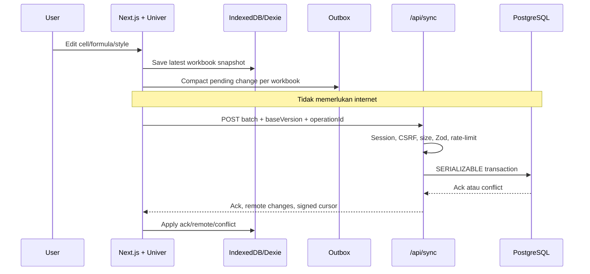

# Arsitektur LocalSheet

## Sasaran

LocalSheet menggunakan prinsip **local-first**: penulisan ke penyimpanan perangkat menjadi jalur utama, sedangkan database server menjadi replika akun yang diperbarui ketika koneksi tersedia. Dengan demikian, kegagalan jaringan tidak membatalkan pekerjaan pengguna.

## Alur data

## Pembagian tanggung jawab

| Lapisan               | Komponen                                                  | Tanggung jawab                                                  |
| --------------------- | --------------------------------------------------------- | --------------------------------------------------------------- |
| Domain                | `lib/domain/workbook.ts`                                | Entitas dan kontrak sinkronisasi tanpa ketergantungan framework |
| Application           | `SyncService`                                           | Orkestrasi push/pull dan kebijakan batc                         |
| Port                  | `IWorkbookRepository`, `ISyncTransport`               | Inversion of Control untuk storage dan transport                |
| Client infrastructure | `DexieWorkbookRepository`, `HttpSyncTransport`        | IndexedDB dan HTTP adapter                                      |
| Server infrastructure | `PostgresAccountRepository`, `PostgresSyncRepository` | Persistence PostgreSQL dan transaksi                            |
| Delivery              | App Router pages dan API routes                           | UI, autentikasi, parsing request, HTTP response                 |

## Design pattern

- **Repository Pattern:** persistence lokal dan global dipisahkan dari use case.
- **Adapter Pattern:** Dexie, Fetch, dan PostgreSQL memenuhi kontrak lapisan aplikasi.
- **Outbox Pattern:** perubahan lokal dicatat sebelum request jaringan dilakukan.
- **Application Service:** `SyncService` mengatur sinkronisasi tanpa mengetahui implementasi database.
- **Optimistic Concurrency Control:** setiap workbook memakai `version`; update hanya berhasil saat `baseVersion` sama.
- **Idempotent Consumer:** `operationId` mencegah operasi yang sama diterapkan dua kali.
- **Unit of Work:** satu batch diproses dalam transaksi PostgreSQL `SERIALIZABLE`.

## Strategi konflik

Starter ini menyinkronkan **snapshot workbook**, bukan operasi per sel. Bila dua perangkat mengubah workbook yang sama dari versi dasar yang sama, perangkat kedua menerima konflik. Pengguna memilih:

1. **Pertahankan lokal:** snapshot lokal dikirim ulang dengan versi server terbaru sebagai dasar.
2. **Gunakan server:** Outbox lokal dibuang dan snapshot server diterapkan.

Untuk kolaborasi bersamaan dengan banyak editor, ganti snapshot-level sync dengan operation log, OT, atau CRDT.

## Boundary keamanan

- Identitas user berasal dari session cookie, bukan body request.
- Browser storage diikat ke akun pertama sebelum sync.
- Body dibaca secara streaming dan dihentikan ketika melebihi batas.
- Schema Zod bersifat strict; field tambahan ditolak.
- SQL selalu memakai positional parameter.
- Cursor ditandatangani HMAC dan terikat ke user.
- Update workbook dibatasi oleh `(user_id, id, version)`.
- CSP, Fetch Metadata, custom anti-CSRF header, SameSite cookie, dan rate limit diterapkan sebagai defense in depth.
